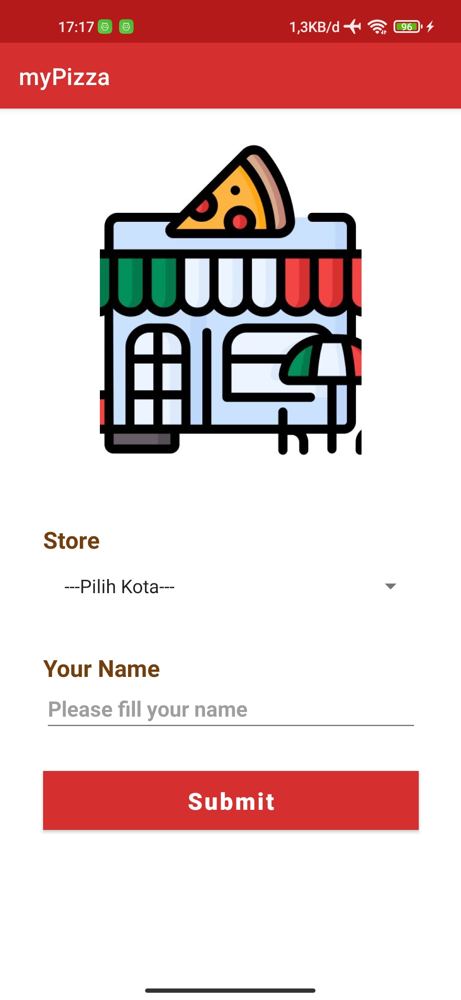
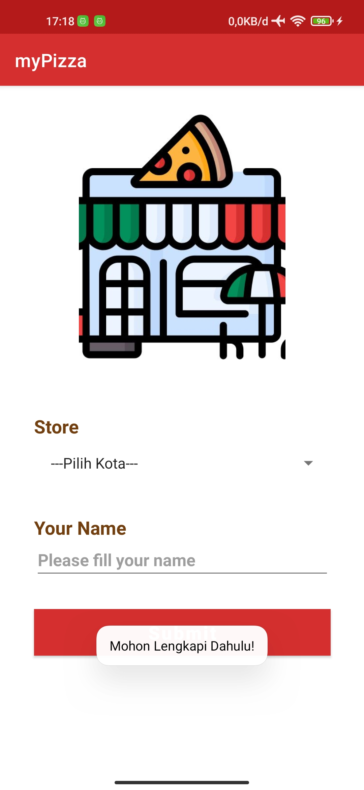
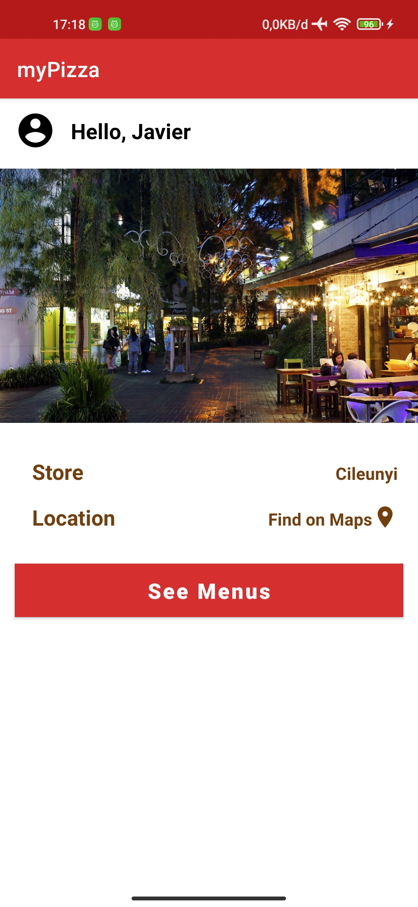
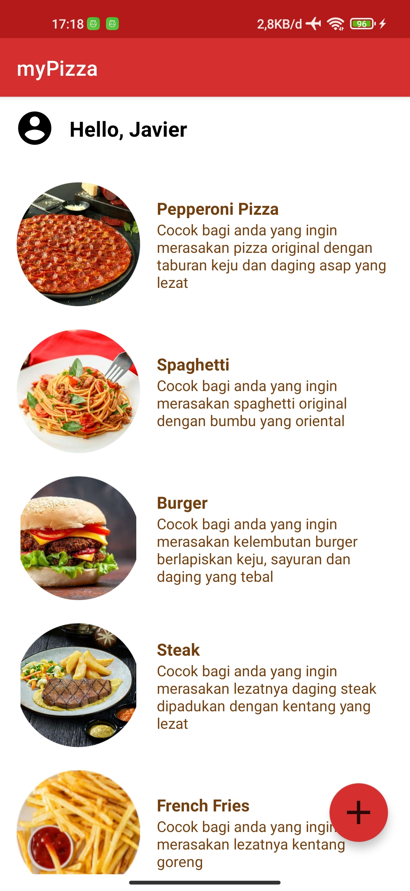
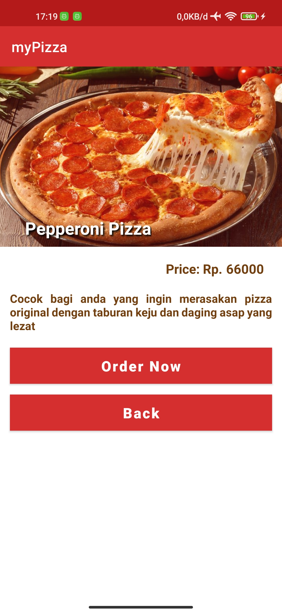
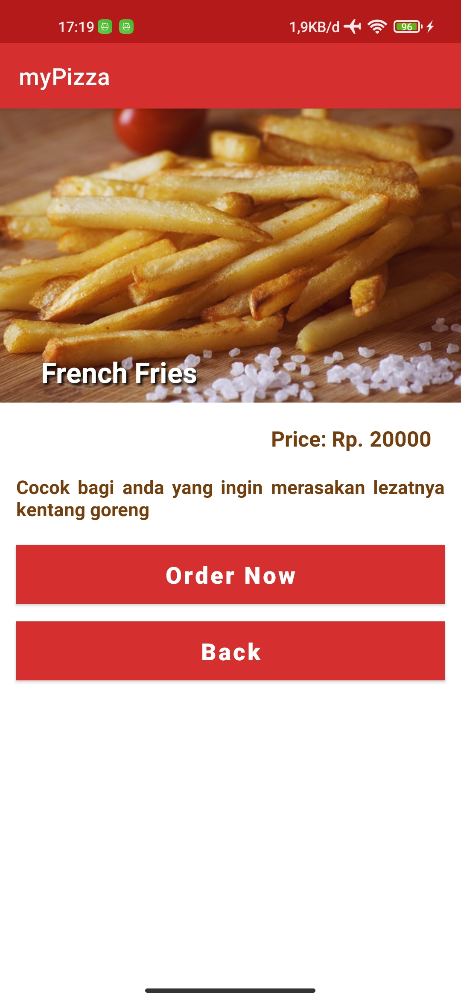
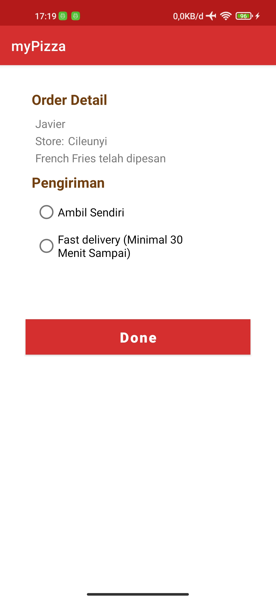
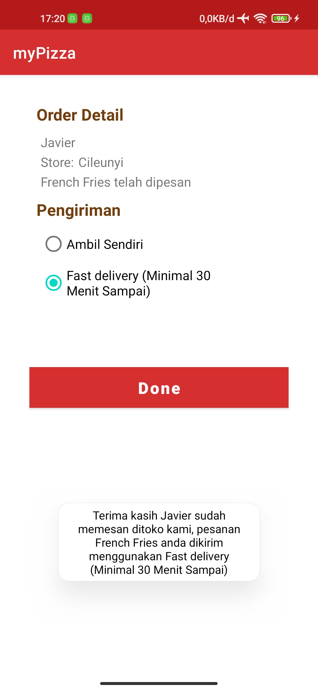

# 1207050055-Jalalul Mu'ti
[Teknik Informatika](http://if.uinsgd.ac.id/) [UIN Sunan Gunung Djati Bandung](https://uinsgd.ac.id/)

# Dependencies Retrofit + GsonConvert
Lokasi :> Build.gradle
` 
//    Retrofit
    implementation 'com.squareup.retrofit2:retrofit:2.9.0'

//    GSON Converter
    implementation 'com.squareup.retrofit2:converter-gson:2.9.0' `

# Android Permissison INTERNET
Lokasi :> AndroidManifest.xml

` <uses-permission android:name="android.permission.INTERNET"/>
 `

# API
` https://retoolapi.dev/StWODX/ `

# EndPoint
` public interface JsonApi {

    @GET("uasresto")
    Call<List<ProductModel>> getProduct();
} `

# Model

` public class ProductModel {

    @SerializedName("id")
    @Expose
    private int id;
    @SerializedName("price")
    @Expose
    private String price;
    @SerializedName("number")
    @Expose
    private String number;
    @SerializedName("details")
    @Expose
    private String details;
    @SerializedName("foodName")
    @Expose
    private String foodName;

    public int getId() {
        return id;
    }

    public String getPrice() {
        return price;
    }

    public String getNumber() {
        return number;
    }

    public String getDetails() {
        return details;
    }

    public String getFoodName() {
        return foodName;
    }

} `

# implement retrofit
` Retrofit retrofit = new Retrofit.Builder().baseUrl(BASE_URL)
                .addConverterFactory(GsonConverterFactory.create()).build();

JsonApi jsonApi = retrofit.create(JsonApi.class);
Call<List<ProductModel>> call = jsonApi.getProduct(); `

# Screen
## Tampilan Awal

## Tampilan Toast Masuk Error (Kosong)

## Tampilan Setelah Masuk

## Tampilan Menu

## Tampilan Detail Menu

## Tampilan Detail Menu 2

## Tampilan Order

## Tampilan Toast Order Berhasil

